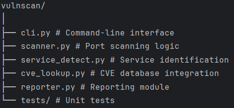

# Python Vulnerability & Port Scanner with CVE Lookup

A Python-based vulnerability and port scanner that detects open ports, identifies running services, and checks for known vulnerabilities (CVEs) using public databases.

---

## Features
- Fast TCP port scanning
- Service & version detection
- CVE lookup for discovered services
- HTML/JSON report generation
- CLI interface

---

## Project Structure

